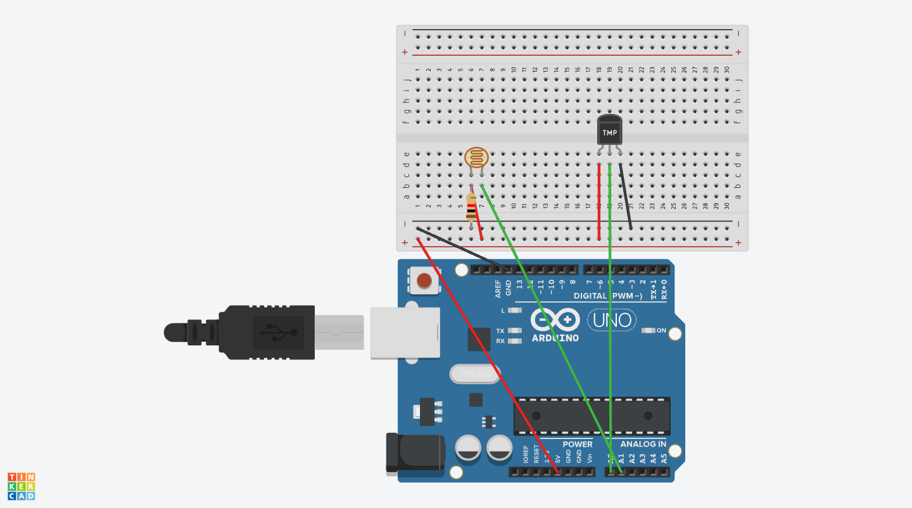

# Greenhouse Monitor

The **Greenhouse Monitor** is a web-based application that connects to an Arduino device to provide real-time monitoring of environmental conditions within your greenhouse. It tracks temperature and light intensity, helping you ensure optimal growth conditions for your plants. The application features a user-friendly interface with light and dark modes, temperature unit toggling, and easy connectivity to your Arduino via serial communication.

## Table of Contents

- [Features](#features)
- [Demo](#demo)
- [Getting Started](#getting-started)
  - [Prerequisites](#prerequisites)
  - [Hardware Setup](#hardware-setup)
  - [Software Setup](#software-setup)
- [Usage](#usage)
- [Customization](#customization)

## Features

- **Real-Time Monitoring**: Displays live temperature and light intensity readings from your greenhouse.
- **Temperature Unit Toggle**: Switch between Celsius and Fahrenheit.
- **Light and Dark Modes**: User interface supports both light and dark themes.
- **Serial Communication**: Connects to Arduino via Web Serial API.

## Demo


## Getting Started

### Prerequisites

- **Hardware**:
  - Arduino Uno (or compatible board)
  - TMP36 Temperature Sensor
  - Photoresistor
  - 10 kΩ Resistor
  - Breadboard and Jumper Wires
  - USB Cable for Arduino

- **Software**:
  - [Arduino IDE](https://www.arduino.cc/en/software)
  - [Visual Studio Code](https://code.visualstudio.com/) (or any code editor)
  - Web browser with Web Serial API support (Google Chrome or Microsoft Edge)

### Hardware Setup

#### Circuit Diagram

Connect the components as shown in the diagram below:

- **TMP36 Temperature Sensor**:
  - **Pin 1 (Vs)**: Connect to **+5V** on Arduino.
  - **Pin 2 (Vout)**: Connect to **Analog Pin A0** on Arduino.
  - **Pin 3 (GND)**: Connect to **GND** on Arduino.

- **Photoresistor Circuit** (Voltage Divider Setup):
  - One end of the **photoresistor** to **+5V**.
  - Other end of the **photoresistor** to **Analog Pin A1**.
  - Connect a **10 kΩ resistor** from **Analog Pin A1** to **GND**.



### Software Setup

1. **Clone the Repository**:

   ```bash
   git clone https://github.com/FekryMostafa/Arduino-Greenhouse-Monitor.git
   ```

2. **Arduino Setup**:

   - Open the Arduino IDE.
   - Load the provided Arduino code (`GreenhouseMonitor.ino`).
   - Select the correct board and port from the **Tools** menu.
   - Upload the code to your Arduino board.

   ```cpp

    // Define sensor pins
    #define TEMP_SENSOR_PIN A0
    #define PHOTOCELL_PIN A1

    void setup() {
    // Initialize Serial communication at 9600 baud rate
    Serial.begin(9600);
    }

    void loop() {
    // Read temperature sensor (TMP36)
    int tempReading = analogRead(TEMP_SENSOR_PIN);
    float tempVoltage = tempReading * (5.0 / 1023.0); // Convert to voltage (0 - 5V)
    float temperatureC = (tempVoltage - 0.5) * 100.0; // Convert voltage to Celsius

    // Read photocell sensor
    int lightReading = analogRead(PHOTOCELL_PIN);
    // Optionally, map the lightReading to a percentage
    int lightPercentage = map(lightReading, 0, 1023, 0, 100);

    // Create JSON formatted string
    String dataString = "{";
    dataString += "\"temperature\":" + String(temperatureC, 2) + ",";
    dataString += "\"light\":" + String(lightPercentage);
    dataString += "}";

    // Send data over Serial
    Serial.println(dataString);

    // Wait for 1 second before next reading
    delay(1000);
    }

   ```

## Usage

1. **Connect the Arduino**:

   - Ensure your Arduino is connected to your computer via USB.
   - Confirm that the Arduino is running the uploaded code.

2. **Open the Web Application**:

   - Use a compatible web browser (Chrome or Edge).
   - Open the html file.

3. **Connect to Arduino**:

   - Click the **"Connect to Arduino"** button on the web page.
   - Select the appropriate serial port from the prompt.
     - **Windows**: `COM3`, `COM4`, etc.
     - **macOS**: `/dev/cu.usbmodemXXXX`

4. **View Real-Time Data**:

   - The application will display temperature and light intensity.
   - Use the **"Switch to °F/°C"** button to toggle temperature units.
   - Toggle between light and dark modes using the theme switcher.

## Customization

- **Adjust Update Interval**:

  - Modify the `delay(1000);` line in the Arduino code to change the data refresh rate.

- **Change UI Themes**:

  - Edit the CSS variables in the `:root` and `[data-theme="dark"]` selectors in `index.html` to customize colors.

- **Extend Functionality**:

  - Add more sensors (humidity, soil moisture) by expanding the Arduino code and updating `app.js` accordingly.
  - Enhance the web interface with additional features or styling.
